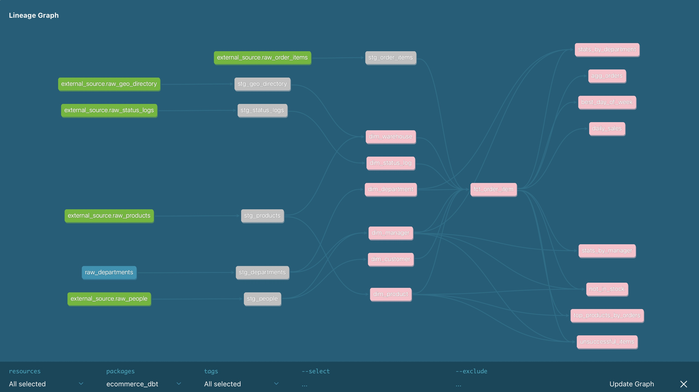

# 📊 E-commerce Analytics: End-to-End ELT Pipeline

## 🌟 Project Overview

This project implements a production-style Data Warehouse using **Airflow**, **dbt Core**, and **DuckDB**. We transform raw e-commerce data from multiple sources (MySQL, JSON, MinIO) into analytics-ready aggregations. The project follows a **Raw - Staging - Mart** architecture, ensuring data quality through automated tests and optimizing performance with incremental loading and strategic scheduling.

-----

## 🏗 Architecture & Data Flow

We implemented an **ELT (Extract, Load, Transform)** pattern orchestrated by Apache Airflow:

1.  **Extract & Load:** Airflow DAGs fetch data from:
      * **OLTP (MySQL):** Transactional data (orders, products, people).
      * **Semi-structured (JSON):** Order status logs.
      * **Object Storage (MinIO):** Large CSV files for geographic directories.
2.  **Storage:** Data is loaded into a **DuckDB** local instance using **Pandas** for intermediate processing.
3.  **Transform:** **dbt** handles the transformation layers within DuckDB.
4.  **Orchestration:** Airflow manages dependencies and triggers dbt builds based on data frequency tags.

-----

## 🕰 Orchestration & Scheduling

We designed two separate DAGs to optimize resource usage and meet business requirements:

### 1\. Hourly Pipeline (`hourly_data_parsing`)

  * **Schedule:** `@hourly`
  * **Logic:** Extracts incremental updates for `raw_order_items` from MySQL (using `MAX(id)` logic) and refreshes `status_logs` from JSON.
  * **dbt Command:** `dbt build --select tag:hourly` — triggers only time-sensitive models.

### 2\. Daily Pipeline (`daily_data_parsing`)

  * **Schedule:** `@daily`
  * **Logic:** Synchronizes master data (Products, People) from MySQL and reference data (Geo Directory) from **MinIO**.
  * **dbt Command:** `dbt build --select tag:daily` — updates dimensions and heavy analytical aggregations.

-----

## 🧱 Data Modeling (20+ Models)

We organized the transformation logic into three distinct layers:

### 1\. Staging Layer (`models/staging`)

  * **Purpose:** Standardizing raw data (renaming, type casting, basic cleaning).
  * **Models:** `stg_people`, `stg_order_items`, `stg_products`, `stg_departments`, `stg_status_logs`.

### 2\. Marts Layer (`models/mart/core`)

  * **Purpose:** Business-level entities and facts.
  * **Key Features:** \* **Incremental Loading:** Used in 5 core models (e.g., `dim_customer`, `fact_order_item`) to handle data growth efficiently.
      * **Window Functions:** Implemented in `dim_status_log` to capture the latest status per order.

### 3\. Analytics Layer (`models/mart/analytics`)

  * **Purpose:** Aggregated metrics for reporting.
  * **Key Insights:**
      * `stats_by_department` & `stats_by_manager`: Performance ranking using window functions.
      * `daily_sales` & `best_day_of_week`: Temporal sales trends.
      * `not_in_stock`: Operational alerts for inventory management.

-----

## ⛓️‍💥 Lineage Graph

  

-----

## ⚡ Key Technical Features

  * **MinIO Integration:** Used for high-volume CSV storage to avoid the limitations of dbt seeds.
  * **Data Quality:** Automated testing for `unique`, `not_null`, and `relationships`. We also added custom tests:
      * `is_non_negative`: Ensures financial metrics are valid.
      * `is_positive`: Validates quantities and prices.
  * **Advanced SQL:** Extensive use of CTEs, window functions for ranking, and incremental predicates.

-----

## 🛠 Tech Stack

  * **Orchestration:** Apache Airflow
  * **Transformation:** dbt Core
  * **Database:** DuckDB
  * **Processing:** Pandas
  * **Storage:** MySQL (OLTP), MinIO (S3-compatible), JSON
